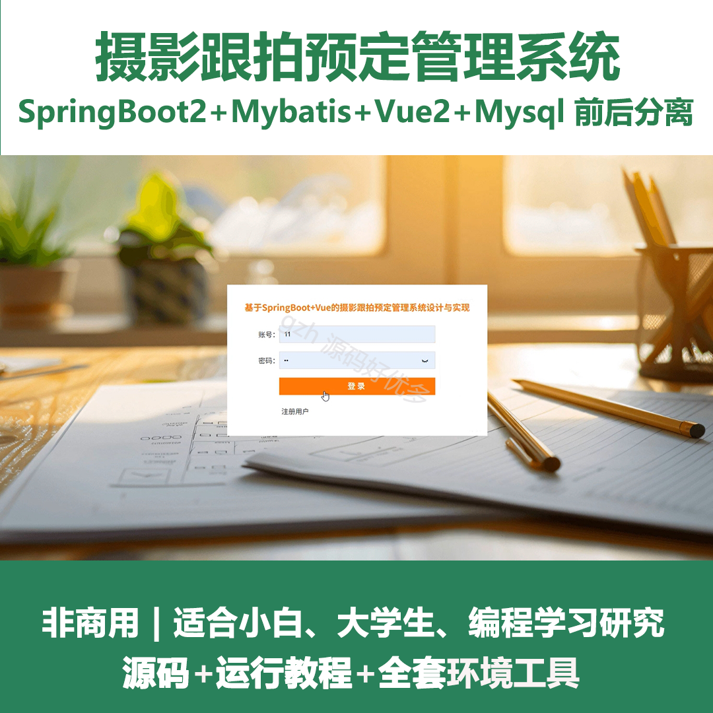
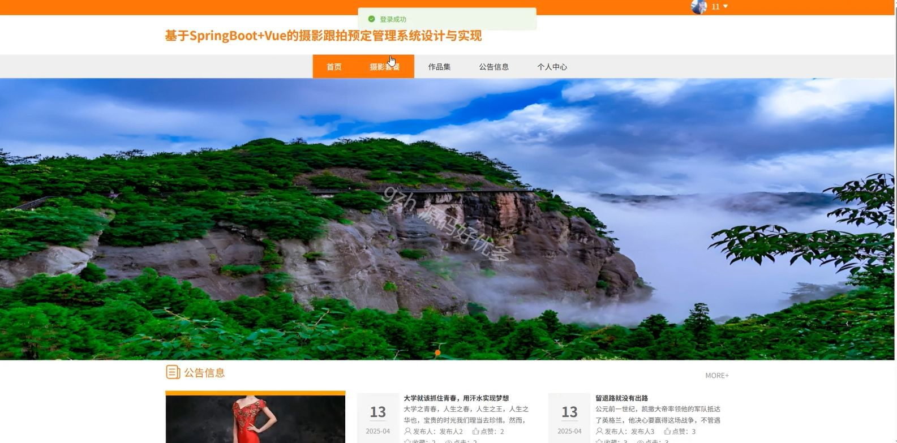
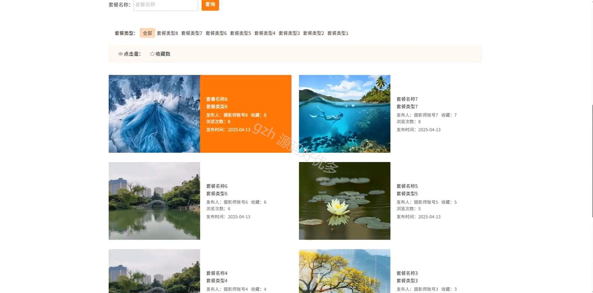
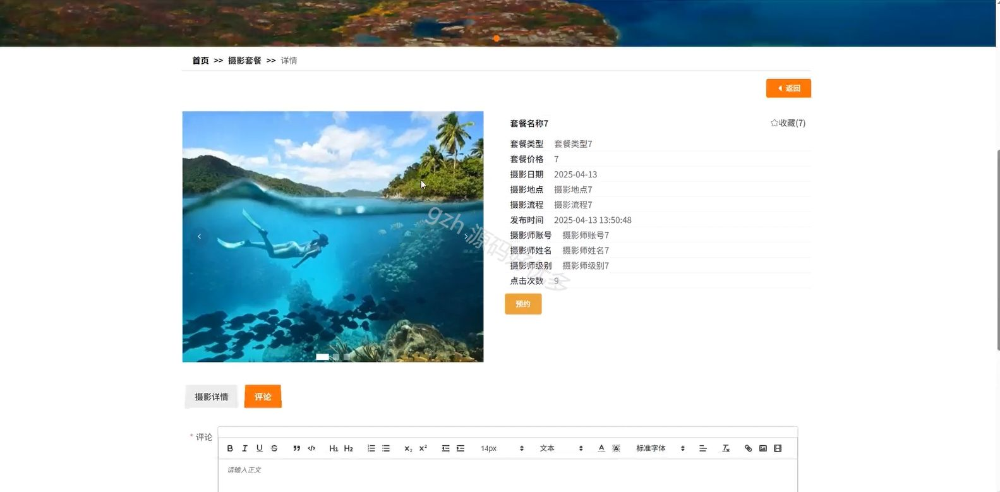
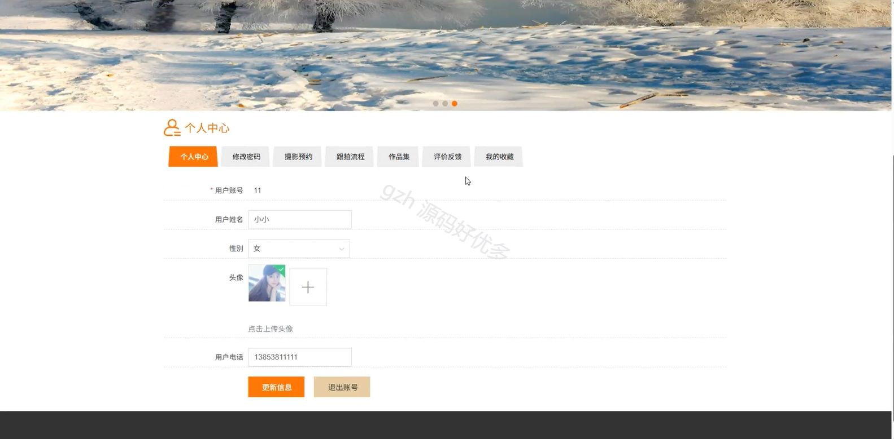
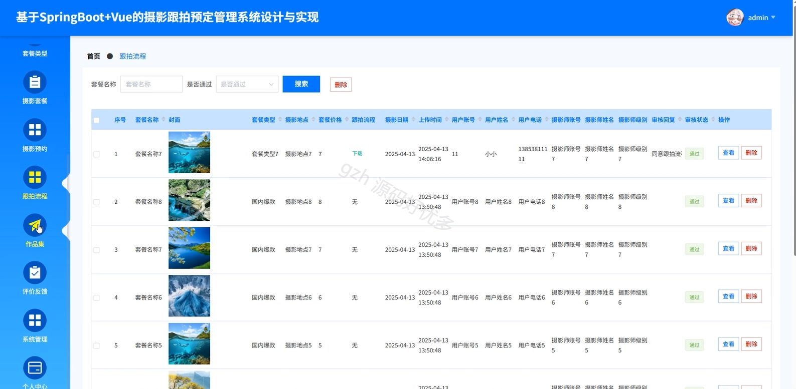
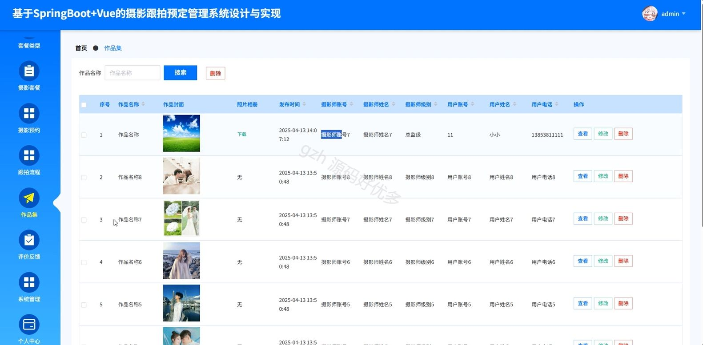
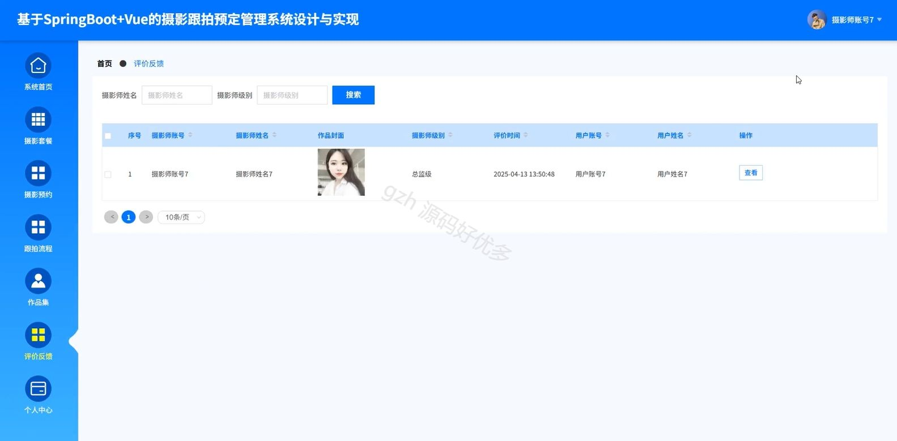
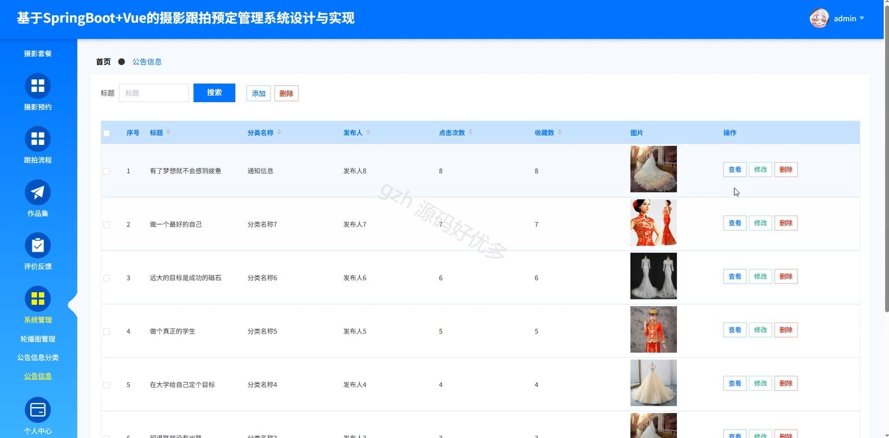

# springbootA389D
springbootA389D摄影跟拍预定管理系统
## 查看主页获取源码

### 一、关键词

摄影套餐、摄影预约、跟拍预定

 

### 二、作品包含

源码+数据库+全套环境和工具资源+部署教程

 

### 三、项目技术

前端技术：Html、Css、Js、Vue2.0、Element-ui 
后端技术：Java、SpringBoot2.0、MyBatis

  

 

### 四、运行环境（以下版本亲测，其他版本未知，请自测）

开发工具：IDEA/eclipse  + VSCODE

数据库：MySQL5.7（最低要5.7版本）

数据库管理工具：Navicat10以上版本

环境配置软件： JDK1.8 + Maven3.6.3

前端Nodejs：14

浏览器：谷歌浏览器

 

### 五、项目介绍

项目编号：springbootA389D

摄影跟拍预定管理系统可实现客户摄影跟拍需求提交、摄影师资源、服务流程的数字化管理，高效衔接供需，规范业务流程。

角色：管理员、用户、摄影师

管理员功能：系统首页、摄影师、用户、套餐类型、摄影套餐、摄影预约、跟拍流程、作品集、评价反馈、系统管理、个人中心。

用户功能：首页、摄影套餐、作品集、公告信息、个人中心、修改密码、摄影预约、跟拍流程、作品集、评价反馈、我的收藏。

摄影师功能：系统首页、摄影套餐、摄影预约、跟拍流程、作品集、评价反馈、个人中心。

 

### 六、运行截图

